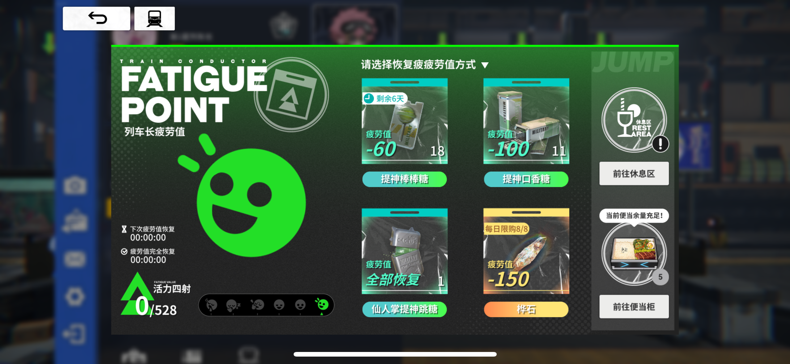

# 雷索纳斯数据站
列车长，欢迎您！这是由某位列车长和他的朋友们搭建的网站，旨在为所有列车长提供比较实时的，可能不准确的的商品价格数据以及成本计算

## 有兴趣参与开发？
说实话，我对自己的代码水平没有任何自信，如果您有面对比屎山还不如的代码的觉悟，就请狠狠的鞭策我吧!

联系我：qq2570351247

### 数据方面
主要有三个地方需要完善
- 雷索纳斯购买商品和贩卖商品之间的关系映射表，在config/good.ts里
  从雷索纳斯的抓包数据来看，同一商品在不同地区的贩卖和购买id都不一样，所以需要建立映射表，已经填充了大部分的数据，但仍有漏网之鱼
- 模拟器自动化更新数据的开发
  已经从咸鱼买了和城市数相符的账号，并且让这些账号在各自的城市待机了
  现在是通过utils/capture.py和mitmdump来抓包并post到本机，但是我电脑性能不能同时开这么多城市数量的模拟器，或许需要考虑使用MaaFramework进行自动化的模拟器内账号切换
  如果您想帮助我在您超绝强大的PC上部署模拟器，请联系我，会把咸鱼买的账号给您用（模拟器自动化刷新商店其实很好做）
- 有一个40级才能去的城市去不了，还有一些制作商品我做不了

### 代码方面
说实话，做这个项目踩了一堆坑，我怎么也不会想到抓包数据同一个商品的id竟然是不一样的，等到数据结构定义完了前端写好了一看怎么这么多奇怪的id才恍然大悟。

所以本项目的数据结构可能定义的比较烂。事先声明。我全责。
还有就是我其实不太懂Next.js，还请大佬多多鞭策

## 关于开源
本项目除了咸鱼买的账号密码不能公开外，其他都根据gplv3许可证协议公开，如果我没记错的话，这是一个传染性的许可证，还请任何想用本仓库任意代码的开发者注意这一点

## 写在最后
参考了以下两个仓库
- puresox/resonance-capture
- NaNExist/ResonanceAssistant<

开发这个站点花费了我三天时间，这三天我雷索纳斯都没怎么登，你见过凌晨三点半疲劳度为0的列车长吗.jpeg

## TODOs:
- [ ]: 完成剩余页面
- [ ]: 做可能的错误检查（比如更新数据库时）
- [ ]: 现在全用的dynamic rendering，感觉不太好
- [ ]: 用MaaFramework来做更新数据的逻辑